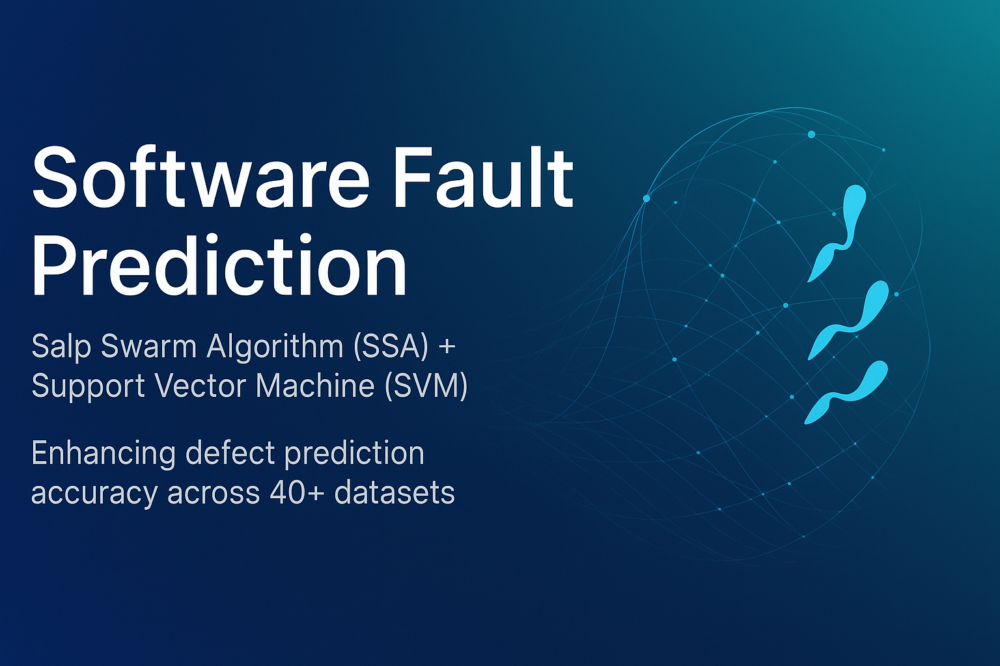

<!-- Banner Image -->


<p align="center">


  


</p>


<h1 align="center">🐛 Software Fault Prediction with SSA + SVM</h1>


<p align="center">


  <em>Graduation project — leveraging the <strong>Salp Swarm Algorithm (SSA)</strong> for hyperparameter optimization of <strong>Support Vector Machines (SVM)</strong> to improve defect prediction accuracy.</em>


</p>


<!-- Badges -->


<p align="center">


  


  


  


  


</p>


---


## 📖 Overview


This project is the result of months of dedicated research and development as part of our **graduation project**.  


It delivers an **automated software fault prediction system** that:  


- **Optimizes SVM hyperparameters** using the **Salp Swarm Algorithm (SSA)**.  


- **Boosts prediction accuracy** of defect-prone modules across **40+ real-world datasets**.  


**🎯 Main Goal:**  


Leverage **population-based metaheuristics** to make defect identification **accurate, more robust, and effective** in real-world software engineering.


---


## 👥 Contributors


- **Karbala Chouaib**  


- **Ouraou Mohamed Abdelillah**  


- **Charane Mohamed Ilies**  


- **Mernache Mohamed Amine**


---


## 📌 Table of Contents


1. [🛠 Tech Stack](#-tech-stack)  


2. [📥 Installation](#-installation)  


3. [🚀 Usage](#-usage)  


4. [⚙ Configuration](#-configuration)  


5. [📂 Project Architecture](#-project-architecture)  


6. [📊 Datasets](#-datasets)  


7. [📬 Contact](#-contact)  


---


## ✨ Features


- 🔍 **SSA Optimization** — Robust evolutionary hyperparameter search for SVM.  


- 📈 **SVM Modeling** — High-performance, tunable classification models.  


- 🛠 **Flexible Configurations** — Modular configs for datasets, models, and HPO strategies.  


- 📊 **Evaluation Tools** — Cross-validation & mean scoring.  


- 🌍 **Dataset Agnostic** — Works with 40+ datasets.  


- 📦 **Extensible** — Add new datasets, models, or optimization methods easily.  


---


## 🛠 Tech Stack


- **Language:** Python 3


- **Core Libraries:**  

  - `PyYAML`
  - `numpy`
  - `pandas`
  - `scikit-learn`


---


📥 Installation
Prerequisites

    Python 3.8+ (tested on 3.11)
    pip package manager
    miniconda (preferred)

Setup

1. Clone the repository


2. Navigate to project directory
cd software-fault-prediction-ssa-svm

3. Install dependencies
pip install -r requirements.txt

🚀 Usage

Run a fault prediction experiment: 
**Usage**
```bash
 python main.py --model MODEL_NAME --hpo OPTIMIZER_NAME --dataset DATASET_NAME
```
**Example:** 
```bash
 python main.py --model svm --hpo sso --dataset ant-1.7
```
⚙ Configuration

Configuration files are located in the config/ directory:

    Data → config/data/

    Model → config/model/

    HPO → config/hpo/

    Evaluation → config/evaluation/

Example:
base_config.yaml contains global experiment settings.
📂 Project Architecture
```
  project_root/
  ├── config/
  │   ├── data/
  │   ├── evaluation/
  │   ├── hpo/
  │   ├── model/
  │   └── base_config.yaml
  ├── data/                  # Datasets
  ├── src/
  │   ├── data/
  │   ├── evaluation/
  │   ├── hpo/
  │   ├── models/
  │   ├── pipeline.py
  │   └── utils.py
  ├── tests/
  │   ├── salp_swarm_optimizer.py
  │   └── test.py
  └── README.md
```
📊 Datasets

    Works with 40+ datasets for software defect prediction.

    Supported: PROMISE repository and CSV datasets.

    Place datasets inside data/ following naming conventions.


📬 Contact

💌 For inquiries, feedback, or collaborations:

    Ouraou Mohamed Abdelillah — abdelillah.ouraou@email.com

    Karbala Chouaib — karballac@gmail.com

<p align="center">⭐ If you like this project, don't forget to give it a star on GitHub!</p>


